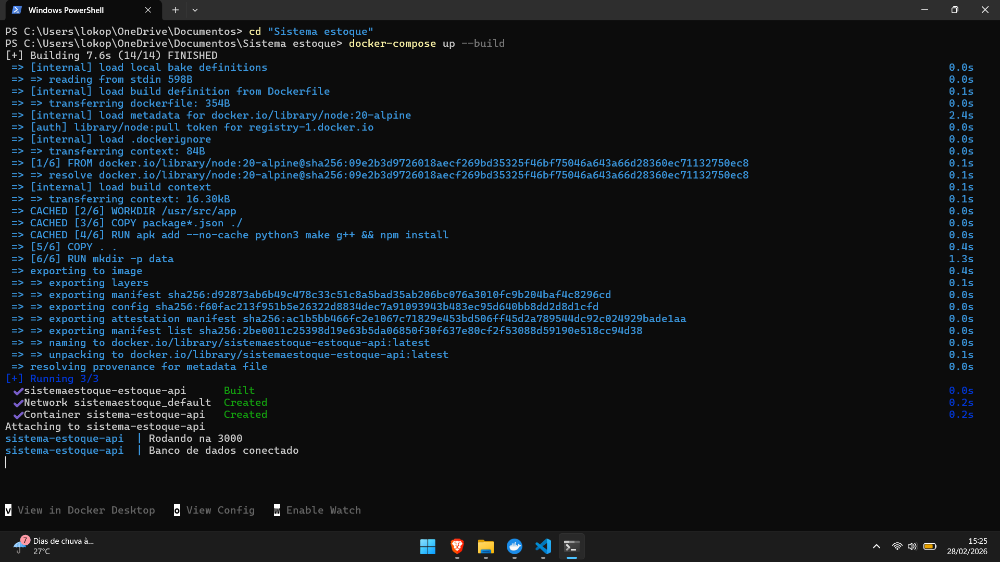
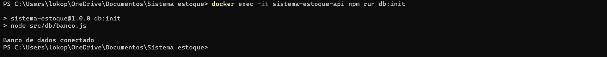
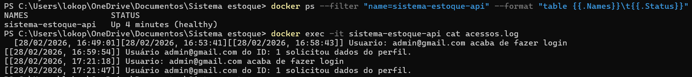
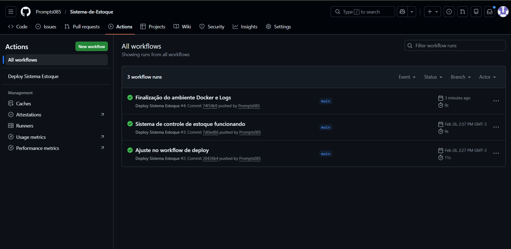

# ==== Sistema de Gestão de Estoque ====

    Este projeto consiste em uma API desenvolvida em Node.js para controle de estoque, focada na implementação de uma infraestrutura robusta utilizando Docker, Persistência de Dados e automação de CI/CD.

# ==== Como Executar o Projeto ====

# Pré-requisitos (antes de subir o Docker):
    Antes de rodar o Docker, certifique-se de criar os arquivos de persistência na raiz do projeto para evitar erros de permissão

    No Linux/macOS:
```
        touch acessos.log relatorio_estoque_baixo.csv
```
    No Windows (PowerShell):
```      
        New-Item acessos.log, relatorio_estoque_baixo.csv -ItemType File
```

### Agora vamos começar:

# 1. Scripts de Clonar o Repositório e os do Docker:
```
git clone https://github.com/Prompts085/Sistema-de-Estoque.git
cd "Sistema-de-Estoque"
```

### Subir o Ambiente (Docker Compose):
```
docker-compose up --build (A API estará disponível em http://localhost:3000)
```
### Inicializar o Banco de Dados:
```
docker exec -it sistema-estoque-api npm run db:init
```

# Alugns detalhes da infraestrutura:

### Docker & Dockerfile:
    Utilizando a imagem leve node:20-alpine. 
    O Dockerfile foi configurado para expor a porta 3000 e inclui um comando de Healthcheck para monitorar a saúde da aplicação.



### volumes no docker-compose.yml para garantir que:
    O banco de dados SQLite (/data/database.sqlite) não seja perdido e arquivo de auditoria (acessos.log) seja persistido no host



### Monitoramento:
    O sistema utiliza a instrução HEALTHCHECK no Dockerfile para monitorar a saúde da aplicação internamente
### comando de validação: 
    ```
    docker inspect --format='{{json .State.Health.Status}}' sistema-estoque-api
    ```


 (No print acima da pra ver que tambem utilizamos o comando para verificar o acessos.log)

### CI/CD com GitHub Actions:
    A automação de deploy está configurada no arquivo .github/workflows/deploy.yml. Toda vez que um push é realizado na branch main, o GitHub Actions valida o build e simula o deploy:




# Principais Rotas de acesso:

    GET /api/registrar: Registrar o admin pra ter acesso ao sistema (essa é a unica que não precisa do token)

    POST /api/login: Rota para fazer login pra obter o token e conseguir ver as outras rotas
    POST /api/movimentacoes/entrada(ou saida): Rota de entrada de produtos ou saida de produtos
    GET /api/relatorio: Exporta relatório de estoque baixo (CSV)
    GET /api/me: Retorna dados do usuário logado.

    POST /api/produtos: Rota que permite criar e adicionar limite de estoque (caso crie um produto do mesmo nome, acaba atualizando o estoque e avisando que o produto já existia)
    

# Como utilizar o Token:
### As rotas /api/relatorio e /api/me são protegidas. Para acessá-las:
    
    Faça login em POST /api/login com as credenciais de admin.
    Copie o token retornado na resposta.
    Nas próximas requisições, adicione o seguinte campo no Header:
    Key: Authorization
    Value: Bearer COLOQUE_O_TOKEN_AQUI


# DESAFIOS ESCOLHIDOS:
    Exportar relatório para CSV
    Endpoint /me retorna dados do usuário logado
    Log de auditoria em arquivo (acessos.log)

### Feito por:
    Marcos Cauã de Freitas Barbosa
### Disciplina:
    Ambiente de Software (ADS)